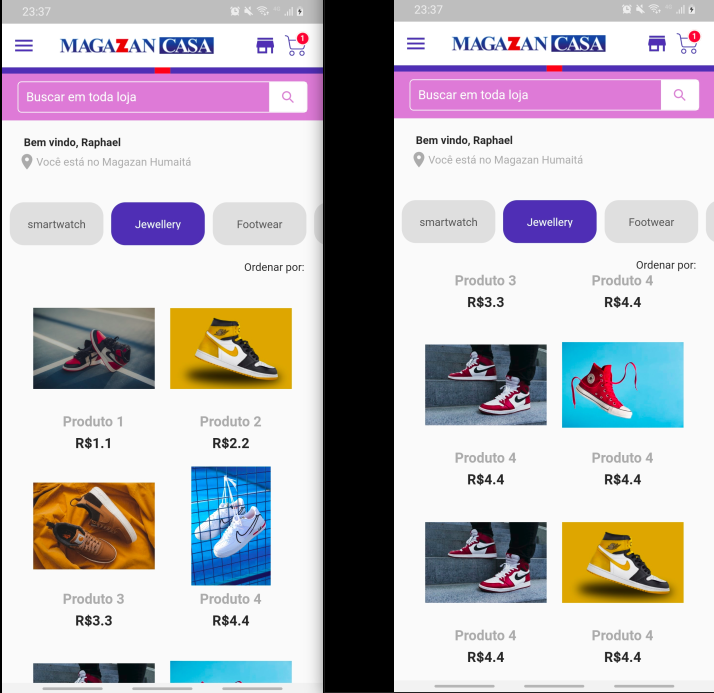
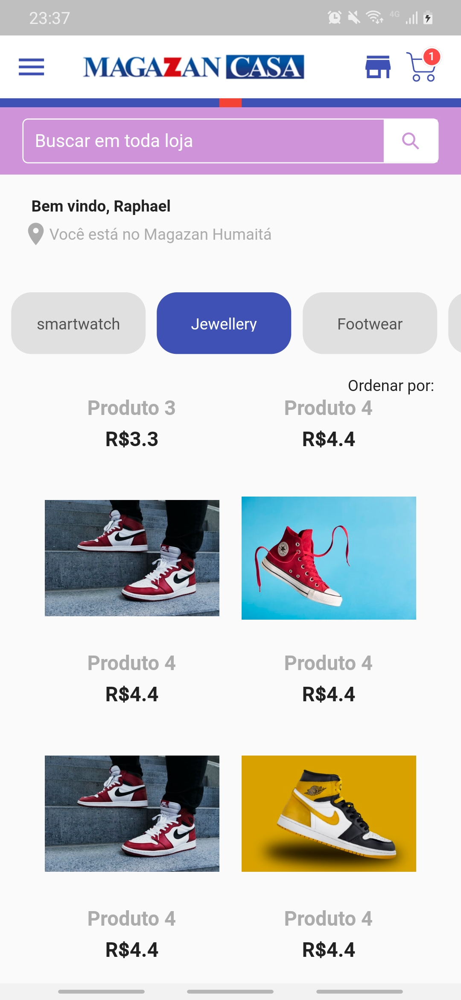
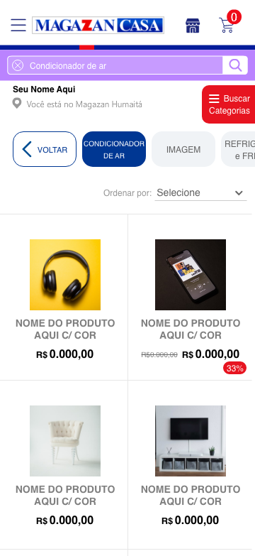

# App Fake Store Lider

 
 

 ## Projeto
 O App construido está incompleto.
 - No Front-end, as informações estão estáticas no momento, mas foram feitos os testes e recebido os dados json enviados back-end.
- No back-end, as rotas foram construídas e estão recuperando as informações da API <a href="https://fakestoreapi.com/docs">Fakestore.</a>

## Adversidades

- Devido a falta de afinidade com as Techs Dart e Flutter, o App desenvolvido está incompleto, com as feature proposta, em contra partida mostra a absorção da linguagem e framework no período de 7 dias. 

 ## Desafio para desenvolvedor 2021.1

Vaga: Desenvolvedor Full Stack

O desafio busca analisar se o candidato possui as habilidades necessárias para a vaga que estamos propondo. Ele será apresentado em duas frentes, front-end e back-end.

Para o back-end será necessário desenvolver uma API. Utilizamos NodeJS para o desenvolvimento das nossas API's.

Para o front-end deverá ter uma aplicação Flutter que consuma os dados da API que você desenvolveu para mostrar as informações de acordo com o layout proposto.

## Desafio
- Front-end
  - Seguir o layout proposto
  - Consumir uma API criada para popular layout
- Back-end
  - Desenvolver uma API pegando os dados desta API FakeStore.
    - Produtos
      - ID
      - Nome
      - Descrição
      - Preço
      - Categoria

## Layout proposto

## Techs

* [ ] NodeJS
* [ ] Dart
* [ ] Flutter

